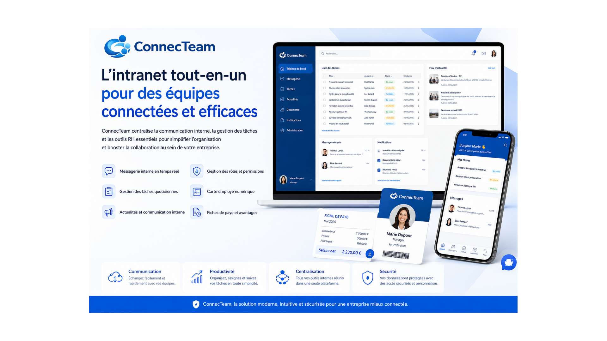

# NexTeam
### *L'intranet nouvelle génération qui unifie vos équipes.*

Plateforme intranet permettant la communication et la gestion interne des employés. NexTeam répond à un besoin majeur rencontré dans de nombreuses entreprises : le manque de communication et de centralisation des échanges entre les employés, les ressources humaines, les responsables et les managers.

L’application NexTeam permet de pallier cette problématique grâce à un système de messagerie intégré favorisant les échanges rapides et directs entre les différents acteurs de l’entreprise. La plateforme permet également de centraliser plusieurs outils internes au sein d’une seule application afin de simplifier l’organisation et améliorer la productivité des équipes.

[](https://angular.io/)
[](https://spring.io/projects/spring-boot)
[](https://www.postgresql.com/)
[](https://www.docker.com/)

---

## 💡 La Problématique
Dans de nombreuses entreprises, l'information est **fragmentée** : messages dispersés, outils multiples, documents difficiles à retrouver.  
Cette dispersion réduit la productivité et complique la communication interne.

---

## 🎯 La Solution : NexTeam
**NexTeam** est une plateforme centralisée qui regroupe communication, gestion et informations internes dans une interface moderne, sécurisée et intuitive.

---

## 📸 Aperçu du Dashboard



---

## 🔥 Fonctionnalités Clés

### 💬 Communication Instantanée
- Messagerie temps réel via **WebSockets (STOMP)**
- Fil d’actualités interne dynamique

### 📋 Productivité & Organisation
- Gestion de tâches et suivi des missions
- Carte employé numérique
- Centralisation des informations internes

### 🛡️ Sécurité & Accès
- Authentification sécurisée **JWT**
- Hashage des mots de passe avec **BCrypt**
- Gestion des rôles (Admin, RH, Manager, Employé)

---

## 🛠️ Stack Technique

| Frontend | Backend | Base de données & Ops |
|----------|---------|------------------------|
| Angular 21 | Spring Boot 3 | MySQL / PostgreSQL |
| TypeScript | Java 21 | JPA / Hibernate |
| SCSS / RxJS | Maven | Docker |
| WebSocket (STOMP) | Spring Security / JWT | REST API |

---

## ⚙️ Installation Rapide

### 1. Prérequis
- Node.js + Angular CLI
- Java 21 (JDK)
- PostgreSQL
- Docker (optionnel)

---

### 2. Lancer le Backend
```bash
cd backend
./mvnw spring-boot:run
3. Lancer le Frontend
cd frontend
npm install
ng serve
```
### 🌐 Accès
```bash
http://localhost:4200
````

## 📖 Pourquoi ce projet ?

NexTeam est conçu avec une approche Product-First et orientée entreprise.

Objectifs :

Réduire la fragmentation des outils internes
Améliorer la communication en temps réel
Expérimenter une architecture moderne (Angular + Spring Boot + WebSockets)

### 👨‍💻 Auteur

Jonatan NS – Développeur Fullstack
